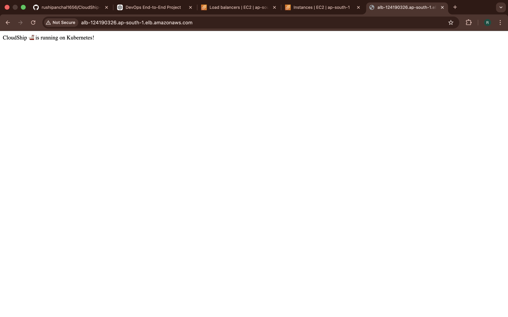
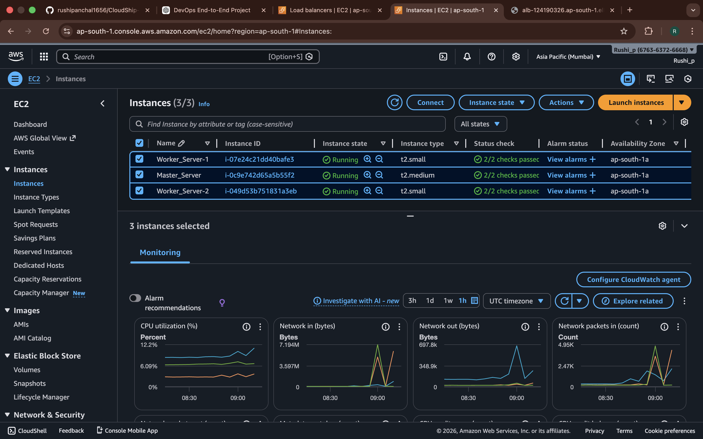
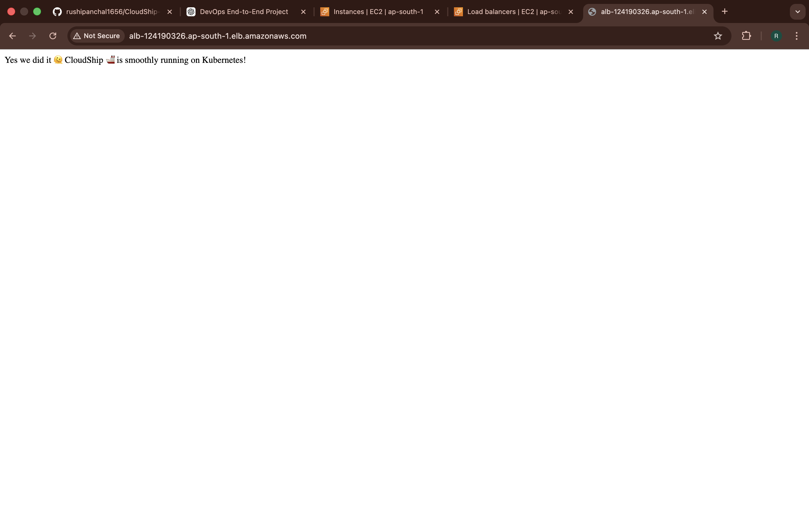
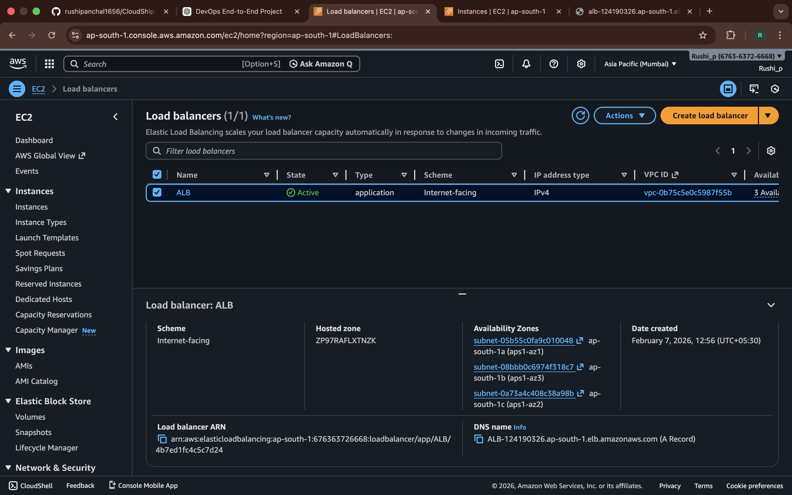
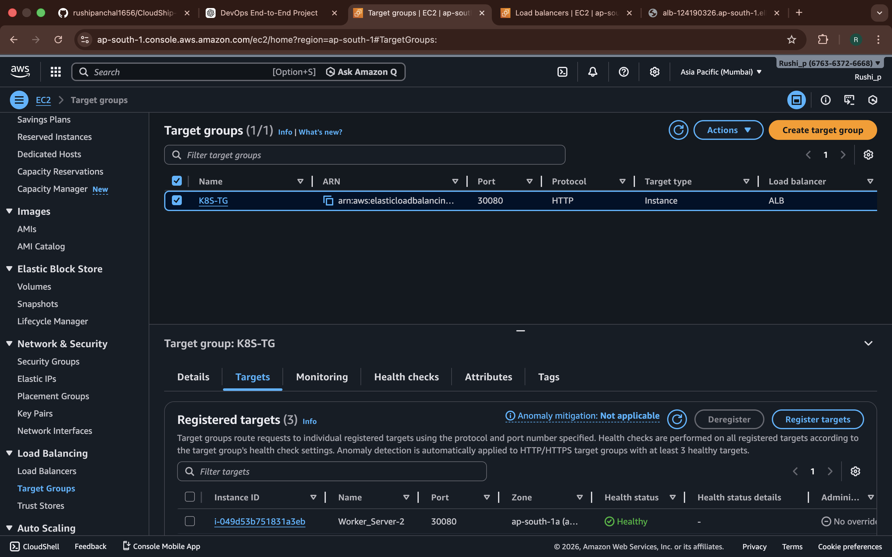

# CloudShip 🚢 - End-to-End Kubernetes CI/CD Platform

# Overview

CloudShip is a complete, production-ready example of a modern CI/CD pipeline with Kubernetes. It demonstrates industry best practices for containerization, orchestration, and automated deployment. Perfect for learning DevOps concepts or as a template for your own projects!
  

## ⚡ Features

- 🐳 **Containerized App** - Python Flask in Docker with multi-stage builds
- ☸️ **Kubernetes Deployment** - Full K8s manifests with 2 replicas
- 🤖 **CI/CD Automation** - GitHub Actions for automated build & deploy
- 📈 **Scalable** - Auto-scaling and rolling updates
- 🌐 **AWS ALB Ready** - Ingress controller with AWS Load Balancer
- ✅ **Health Checks** - Liveness and readiness probes included

## 📋 Prerequisites

```bash
# Required tools
docker --version        # v20.10+
kubectl version         # v1.20+
python --version        # v3.10+
git --version
```

## 🚀 Quick Start

### 1. Clone & Setup

```bash
git clone <repo-url>
cd CloudShip-End-to-End-Kubernetes-CI-CD-Platform

# Setup Kubernetes namespace
kubectl apply -f k8s/namespace.yaml
```

### 2. Run Locally

```bash
cd app
pip install -r requirements.txt
python app.py
# Visit http://localhost:5000
```

**Application Running:**


### 3. Run in Docker

```bash
docker build -t cloudship:latest .
docker run -p 5000:5000 cloudship:latest
# Visit http://localhost:5000
```

### 4. Deploy to Kubernetes

```bash
kubectl apply -f k8s/
kubectl get ingress -n cloudship
# Get ALB DNS from ingress address
```

**Kubernetes Infrastructure:**


## 📁 Project Structure

```
app/                  # Flask application
k8s/                  # Kubernetes manifests
  ├── namespace.yaml
  ├── deployment.yaml      # 2 replicas, rolling updates
  ├── service.yaml         # ClusterIP service
  ├── ingress.yaml         # AWS ALB integration
  ├── configmap.yaml
  └── secret.yaml
.github/workflows/    # GitHub Actions CI/CD
Dockerfile
```

## 🔧 Configuration

### Environment Variables

```bash
PORT=5000          # App port
ENV=production     # Environment
```

### Kubernetes Customization

Edit `k8s/deployment.yaml`:
- Change image: `rushipanchal/cloudship:latest`
- Adjust replicas: `spec.replicas: 2`
- Resource limits: `requests` and `limits`

## 🔄 CI/CD Setup

### Add GitHub Secrets

| Secret | Value |
|--------|-------|
| `DOCKER_USERNAME` | Docker Hub username |
| `DOCKER_PASSWORD` | Docker Hub token |
| `EC2_HOST` | Kubernetes master IP |
| `EC2_SSH_KEY` | SSH private key |

### Deploy

```bash
git add .
git commit -m "Update app"
git push origin main
# Automatic build, push, and K8s deployment
```

**CI/CD Application Updates:**


## 📊 Common Commands

```bash
# Check deployment status
kubectl get deployments -n cloudship
kubectl get pods -n cloudship

# View logs
kubectl logs <pod-name> -n cloudship

# Port forward
kubectl port-forward svc/cloudship-service 5000:80 -n cloudship

# Scale replicas
kubectl scale deployment cloudship-deployment --replicas=3 -n cloudship

# Rollback to previous version
kubectl rollout undo deployment/cloudship-deployment -n cloudship
```

**Rollback Process:**


## 🌐 AWS Load Balancer Integration

The application is exposed through AWS Application Load Balancer:

**AWS Load Balancer:**


**Target Groups:**


## 🆘 Troubleshooting

```bash
# Pod not starting?
kubectl describe pod <pod-name> -n cloudship

# Check ingress
kubectl describe ingress cloudship-ingress -n cloudship

# Verify image exists
docker pull rushipanchal/cloudship:latest
```

## 📚 Documentation

- **Full Guide**: See [DEPLOYMENT_GUIDE.md](DEPLOYMENT_GUIDE.md)
- **Updates Summary**: See [UPDATES_SUMMARY.md](UPDATES_SUMMARY.md)
- [Kubernetes Docs](https://kubernetes.io/docs/)
- [Docker Docs](https://docs.docker.com/)

## 📄 License

MIT License - see LICENSE file for details

## 🤝 Contributing

1. Fork the repository
2. Create feature branch: `git checkout -b feature/name`
3. Commit: `git commit -m "Add feature"`
4. Push: `git push origin feature/name`
5. Open Pull Request

---

**Happy shipping with CloudShip! 🚢**
